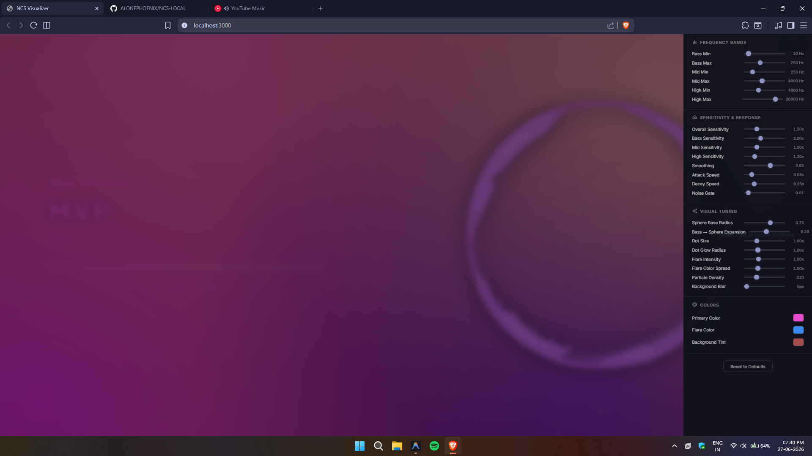

# 🎬 NCS Visualiser
### *A Real-Time WebGL2 Audio Visualizer for Spotify & System Audio*

A WebGL2-powered particle sphere audio visualizer that synchronizes particle movements with system audio analysis via Python/PowerShell backend or Spotify's audio analysis. Features dynamic color extraction, a beautiful fullscreen interface, and word-by-word synced lyrics.

[](LICENSE)
[](https://nodejs.org)
[](https://www.python.org/downloads/)

---

## 📸 Preview

### Normal View


### Standalone WebGL View (Watercolor + Antigravity Particles)


---

## ✨ Features

* 🔴 **NCS-Style Particle Sphere:** High-performance WebGL2 particle system driven by real-time amplitude curves from system audio analysis.
* 🎨 **Dynamic Color Extraction:** Automatically extracts and applies theme colors from album art (when available).
* 🖥️ **Stunning Fullscreen Mode:** Toggle a minimal, beautiful overlay displaying track info, interactive seek bar, and playback controls.
* 🎛️ **Full Playback Controls:** Control media playback with play/pause, next, previous, shuffle, and repeat buttons.
* 🔊 **Volume Controller:** Quick mute button with a smooth hover-reveal volume slider.
* 📊 **Developer Analysis Tools:** Built-in timeline overlays to visualize beats, bars, loudness, timbre, pitches, and rhythm analysis.
* 📐 **Responsive Design:** Completely fluid typography and layout scaling perfectly to any viewport size.

### 🎤 Synced Lyrics Feature Set
* **Word-by-Word Sync:** When paired with the [SpicyLyrics](https://github.com/spicylyricsapp) extension, lyrics are displayed with precise syllable-level sync — each word lights up exactly as it's sung.
* **Smooth Letter Animations:** Letters transition with a glowing highlight sweep. Already-sung letters stay lit with the theme color while upcoming letters remain dim, creating a flowing karaoke-style experience.
* **Active Word Zoom:** The word currently being sung smoothly scales up (1.12×) with a soft ease-in-out transition, then gently scales back down.
* **Music Note Interludes:** During instrumental breaks, animated music symbols (♪ ♫ ♬) bounce and glow in an overlapping sine-wave pattern.
* **Line Fade Transitions:** When a lyric line ends, all letters gracefully fade out together before the next line appears.
* **Lyrics Toggle:** Show/hide lyrics with a single click on the lyrics icon next to the song title.
* **Graceful Fallback:** If SpicyLyrics data isn't available, the visualizer falls back to available lyrics with evenly distributed letter animation.

---

## 🚀 Installation

### 🛠️ Prerequisites

- **Node.js** (v14 or higher) — [Download](https://nodejs.org)
- **Python** (3.9 - 3.13, optional for enhanced performance) — [Download](https://www.python.org/downloads/)
- **Windows** (audio capture currently Windows-only)

### 📥 Setup

1. **Clone the repository**
   ```bash
   git clone https://github.com/ALONEPHOENIX/NCS-LOCAL.git
   cd NCS-LOCAL
   ```

2. **Install Node.js dependencies**
   ```bash
   npm install --prefix standalone
   ```

3. **(Optional) Install Python libraries for better performance**
   ```bash
   pip install winrt-Windows.Media.Control winrt-Windows.Storage.Streams
   ```

4. **Start the server**
   ```bash
   npm start
   ```

5. **Open in browser**
   Navigate to [http://localhost:3000](http://localhost:3000) in your web browser.

> [!NOTE]
> If Python is not installed or the required libraries are missing, the server will automatically fall back to the optimized PowerShell engine — everything will still work perfectly out-of-the-box!

---

## 🖥️ Standalone Browser Visualizer

The visualizer runs as a local web application, capturing your system's real-time audio output.

### ⚡ Features:
- **Multi-Backend Audio Capture**: 
  - **Python (Recommended):** Ultra-low latency via `winrt` bindings to Windows Media Transport Controls
  - **PowerShell (Fallback):** Optimized script-based fallback for Windows systems
- **Dynamic Watercolor Background:** An animated, procedural WebGL2 fragment shader background simulating watercolor paint soaking and warping on coarse textured paper, reacting dynamically to the music.
- **Antigravity Particle Attractor:** 1,800 high-density glowing white capsules that drift randomly, but pull together to form a wavy, pulsating 3D ring whenever you move your cursor near them.
- **Symmetrical Staircase Preloader:** A visualizer loading wipe animation that staggers vertical curtains from the outer edges to the center from both the top and bottom halves of the screen.

### 🚀 Quick Start

1. **Install dependencies**
   ```bash
   npm install --prefix standalone
   ```

2. **Start the local server**
   ```bash
   npm start
   ```

3. **Open the app**
   Open [http://localhost:3000](http://localhost:3000) in your web browser (Brave, Chrome, Firefox, Edge, etc.).

---

## 🛠️ Usage & Controls

| Control / Action | Description |
| :--- | :--- |
| **Enter Fullscreen** | Click the menu button (top-right) → *Enter Fullscreen*, or press `F11`. |
| **Interactive Seek** | Click anywhere along the progress bar to seek playback time. |
| **Previous / Next** | Skip tracks using the overlay controls in fullscreen mode. |
| **Play / Pause** | Toggle playback using the fullscreen button or press `Space`. |
| **Shuffle / Repeat** | Toggle shuffle or repeat modes via fullscreen control toggles. |
| **Volume Control** | Hover over the volume icon to reveal the slider; click to mute/unmute. |
| **Toggle Lyrics** | Click the lyrics icon (🎤) next to the song title to show/hide synced lyrics. |
| **Refresh Lyrics** | If lyrics show "No lyrics available", click the refresh button to retry. |
| **Switch Renderers** | Menu (top-right) → *Renderer* → choose between the WebGL particle sphere or analysis graphs. |
| **Picture-in-Picture** | Menu (top-right) → *Open Window* (opens visualizer in a standalone or PiP window). |

---

## 📁 File Structure

```
NCS-LOCAL/
├── resources/              # Preview screenshots
│   ├── image.png
│   └── image1.png
├── standalone/             # Standalone Browser App
│   ├── backend/            # Audio capture & media session tools
│   │   ├── audio-capture.js
│   │   ├── media-session.js
│   │   └── media-session.py
│   ├── src/                # Web visualizer client files
│   │   ├── index.html      # Main interface
│   │   ├── style.css       # Staircase preloader & HUD styles
│   │   ├── renderer.js     # WebGL circle particle visualizer
│   │   ├── antigravity.js  # Watercolor shader & Three.js particles
│   │   ├── audio-engine.js # FFT audio processing
│   │   └── settings.js     # Settings preference panel
│   ├── server.js           # Local HTTP & WebSocket Node server
│   └── package.json
├── LICENSE                 # License info
└── README.md               # Project documentation
```

---

## 🎨 Customization

You can customize the standalone browser visualizer's settings by editing these files directly:

* **Background Shaders & Particles:** Edit `standalone/src/antigravity.js` to change the colors of the watercolor shader, adjust particle count (`count`), or tune pointer magnet radius (`magnetRadius`).
* **Entry Preloader Curtains:** Edit `standalone/src/style.css` (search for `.preloader`) to tune transition times, column counts, or change keyframe easing parameters.
* **Circle Visualizer:** Edit `standalone/src/renderer.js` to adjust default WebGL settings or circle render properties.
* **Audio Settings:** Edit `standalone/src/audio-engine.js` to modify FFT settings, frequency bands, or sensitivity.

---

## 🛠️ Development & Building

**No build step required!** All WebGL shaders and components are written directly in the source files.

Edit any file in `standalone/src/` or backend files directly, then refresh your browser to see changes instantly (or restart the server if modifying backend files).

---

## 🔧 Troubleshooting

### Audio not playing?
- Ensure you have **Windows Media Player** or similar media controls running
- Check that your system audio is being routed to the default audio device
- Try restarting the Node.js server: `npm start`

### Python bindings failing?
- Install Python 3.9-3.13 with `Add Python to PATH` checked
- Run: `pip install winrt-Windows.Media.Control winrt-Windows.Storage.Streams`
- If issues persist, the server will automatically fall back to PowerShell

### High CPU usage?
- Close other background applications
- Install Python bindings for better performance (reduces polling frequency)
- Check browser DevTools console for any JavaScript errors

---

## 👥 Credits

* WebGL2 particle rendering inspired by standard NCS visualizer designs.
* Audio analysis data powered by system audio capture via Windows Media APIs.
* Lyrics sync powered by **[SpicyLyrics](https://github.com/spicylyricsapp)**.
* Typography: [Rubik Spray Paint](https://fonts.google.com/specimen/Rubik+Spray+Paint) & [Jua](https://fonts.google.com/specimen/Jua) via Google Fonts.
* Icons: [Material Icons](https://fonts.google.com/icons) by Google.

---

## 📄 License

This project is licensed under the Apache License 2.0. See the [LICENSE](LICENSE) file for details.
