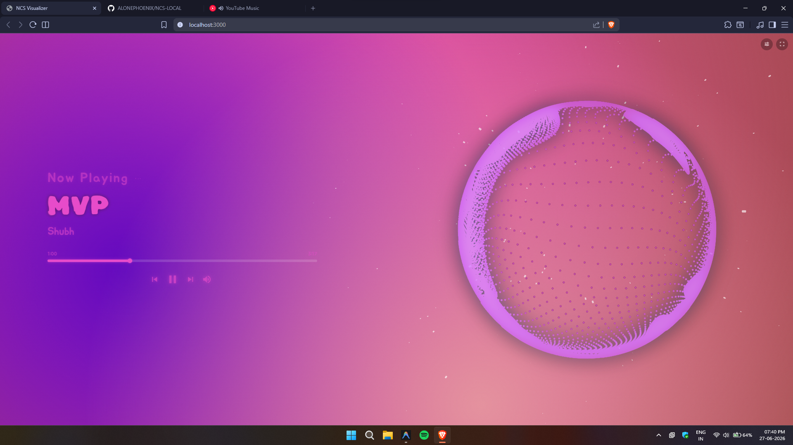

# 🎬 NCS Visualiser
### *A Real-Time WebGL2 Audio Visualizer for Spotify & Standalone Browsers*

A WebGL2-powered particle sphere audio visualizer that synchronizes particle movements with Spotify's audio analysis. Features dynamic color extraction, a beautiful fullscreen interface, **word-by-word synced lyrics**, playback controls, and built-in developer tools.

[](https://spicetify.app)
[](LICENSE)

---

## 📸 Preview

### Normal View


### Standalone WebGL View (Watercolor + Antigravity Particles)


---

## ✨ Features

* 🔴 **NCS-Style Particle Sphere:** High-performance WebGL2 particle system driven by real-time amplitude curves from Spotify's audio analysis.
* 🎨 **Dynamic Color Extraction:** Automatically extracts and applies theme colors from the playing track's album art.
* 🖥️ **Stunning Fullscreen Mode:** Toggle a minimal, beautiful overlay displaying the track name, artist, interactive seek bar, and playback controls.
* 🎛️ **Full Playback Controls:** Control Spotify directly from the visualizer with play/pause, next, previous, shuffle, and repeat buttons.
* 🔊 **Volume Controller:** Quick mute button with a smooth hover-reveal volume slider.
* 📊 **Developer Analysis Tools:** Built-in timeline overlays to visualize beats, bars, loudness, timbre, pitches, and rhythm analysis.
* 📐 **Responsive Design:** Completely fluid typography and layout scaling perfectly to any viewport size.

### 🎤 Synced Lyrics Feature Set
* **Word-by-Word Sync:** When paired with the [SpicyLyrics](https://github.com/spicylyricsapp) extension, lyrics are displayed with precise syllable-level sync — each word lights up exactly as it's being sung.
* **Smooth Letter Animations:** Letters transition with a glowing highlight sweep. Already-sung letters stay lit with the theme color while upcoming letters remain dim, creating a flowing karaoke-style fill effect.
* **Active Word Zoom:** The word currently being sung smoothly scales up (1.12×) with a soft ease-in-out transition, then gently scales back down.
* **Music Note Interludes:** During instrumental breaks, animated music symbols (♪ ♫ ♬) bounce and glow in an overlapping sine-wave pattern.
* **Line Fade Transitions:** When a lyric line ends, all letters gracefully fade out together before the next line appears.
* **Lyrics Toggle:** Show/hide lyrics with a single click on the lyrics icon next to the song title.
* **Graceful Fallback:** If SpicyLyrics data isn't available, the visualizer falls back to Spotify's line-level lyrics with evenly distributed letter animation.

---

## 🚀 Installation

For help with installing or uninstalling, check out the official [Spicetify FAQ](https://spicetify.app/docs/faq) or ask on the [Spicetify Discord](https://discord.gg/VnevqPp2Rr).

### 🛠️ Spicetify Custom App Setup

1. **Open your Spicetify Config Directory**  
   Open your terminal/command prompt and run:
   ```bash
   spicetify config-dir
   ```
2. **Navigate & Create Folder**  
   Navigate to the `CustomApps` folder within that directory. Create a new folder named `visualizer`.
3. **Download Project Files**  
   Download the files from this repository and copy them into the `visualizer` folder you just created:
   * `index.js`
   * `manifest.json`
   * `style.css`
4. **Enable the Custom App**  
   Add the app to your Spicetify configuration by running:
   ```bash
   spicetify config custom_apps visualizer
   ```
5. **Apply Configuration**  
   Finalize the installation and apply changes to Spotify:
   ```bash
   spicetify apply
   ```
6. **Launch**  
   Restart Spotify. A new **Visualizer** button will appear in your sidebar/navigation panel!

> [!TIP]
> **Best Lyrics Experience:**
> For the best word-by-word synced lyrics, install the **SpicyLyrics** extension. Play a few songs with SpicyLyrics open so it caches syllable-level timing data, and the visualizer will automatically pick up the cached syllable data.
>
> If SpicyLyrics is not active, the visualizer gracefully falls back to Spotify's standard line-level lyrics.

---

## 🔄 Upgrading / Migrating

### Upgrading from the older "NCS Visualizer"

If you previously had the older `ncs-visualiser` installed, remove it first to avoid configuration conflicts:

1. Open your Spicetify config directory (`spicetify config-dir`).
2. Navigate to `CustomApps` and **delete** the `ncs-visualiser` folder.
3. Remove the old app from your configuration:
   ```bash
   spicetify config custom_apps ncs-visualiser-
   ```
4. Follow the **Installation Instructions** above to set up the new version.

---

## 🛠️ Usage & Controls

| Control / Action | Description |
| :--- | :--- |
| **Enter Fullscreen** | Click the menu button (top-right) → *Enter Fullscreen*, or press `F11`. |
| **Interactive Seek** | Click anywhere along the progress bar to seek playback time. |
| **Previous / Next** | Skip tracks using the overlay controls in fullscreen mode. |
| **Play / Pause** | Toggle playback using the fullscreen button or press `Space`. |
| **Shuffle / Repeat** | Toggle shuffle or repeat modes via fullscreen control toggles. |
| **Volume Control** | Hover over the volume icon to reveal the slider; click to mute/unmute. |
| **Toggle Lyrics** | Click the lyrics icon (🎤) next to the song title to show/hide synced lyrics. |
| **Refresh Lyrics** | If lyrics show "No lyrics available", click the refresh button to retry. |
| **Switch Renderers** | Menu (top-right) → *Renderer* → choose between the WebGL particle sphere or analysis graphs. |
| **Picture-in-Picture** | Menu (top-right) → *Open Window* (opens visualizer in a standalone or PiP window). |

---

## 🖥️ Standalone Visualizer Mode (Browser Version)

The visualizer can run directly inside any standard web browser (like Brave, Chrome, or Firefox), completely independent of Spicetify or Spotify! It works by capturing your system's raw audio output and query-syncing Windows media player details in real-time.

### ⚡ Features:
- **Zero-Dependency Audio Loopback**: Includes a custom compiled C# binary that binds to the Windows WASAPI audio device, streaming raw PCM amplitudes to the local server.
- **Dynamic Watercolor Background**: An animated, procedural WebGL2 fragment shader background simulating watercolor paint soaking and warping on coarse textured paper, reacting dynamically to the music's mid-range/vocals.
- **Antigravity Particle Attractor**: 1,800 high-density glowing white capsules that drift randomly, but pull together to form a wavy, pulsating 3D ring whenever you move your cursor near them. Includes frame buffer alpha accumulation trails for liquid-like motion ghosting.
- **Symmetrical Staircase Preloader**: A visualizer loading wipe animation that staggers vertical curtains from the outer edges to the center from both the top and bottom halves of the screen.

### 🚀 Quick Start

1. **Install Node.js dependencies**
   ```bash
   npm install --prefix standalone
   ```
2. **Start the local server**
   ```bash
   npm start
   ```
3. **Open the App**
   Open [http://localhost:3000](http://localhost:3000) in your web browser.

### 🚀 High-Performance Windows Media Integration (Optional)

By default, the server queries the **Windows Global System Media Transport Controls (GSMTC)** via an optimized PowerShell fallback script. To achieve ultra-low latency, zero CPU usage, and high-speed media state updates, you can install Python and its native WinRT bindings:

1. **Install Python**  
   Download and install [Python 3.9 - 3.13](https://www.python.org/downloads/) (ensure **"Add Python to PATH"** is checked during installation).
2. **Install Native Bindings**  
   Run the following command in your terminal/command prompt:
   ```bash
   pip install winrt-Windows.Media.Control winrt-Windows.Storage.Streams
   ```

> [!NOTE]
> If Python is not installed or the libraries are missing, the server will automatically fall back to the optimized PowerShell engine, meaning it will still work perfectly out-of-the-box!

---

## 📁 File Structure

```
visualizer/
├── resources/              # Preview screenshots
│   ├── Normal.png
│   └── FullScreen.png
├── standalone/             # Standalone Browser App
│   ├── backend/            # Audio capture & media session tools
│   │   ├── audio-capture.js
│   │   ├── AudioCapture.cs # WASAPI loopback C# source
│   │   ├── media-session.js
│   │   └── media-session.py
│   ├── src/                # Web visualizer client files
│   │   ├── index.html      # Main interface
│   │   ├── style.css       # Staircase preloader & HUD styles
│   │   ├── renderer.js     # WebGL circle particle visualizer
│   │   ├── antigravity.js  # Watercolor shader & Three.js particles
│   │   ├── audio-engine.js # FFT audio processing
│   │   └── settings.js     # Settings preference panel
│   ├── server.js           # Local HTTP & WebSocket Node server
│   └── package.json
├── index.js                # Spicetify Custom App Component
├── style.css               # Spicetify App Styles
├── manifest.json           # Spicetify Manifest file
├── LICENSE                 # License info
└── README.md               # Project documentation
```

---

## 🎨 Customization

You can customize the standalone browser visualizer's settings by editing these files directly:

* **Background Shaders & Particles:** Edit `standalone/src/antigravity.js` to change the colors of the watercolor shader, adjust particle count (`count`), or tune pointer magnet radius (`magnetRadius`).
* **Entry Preloader Curtains:** Edit `standalone/src/style.css` (search for `.preloader`) to tune transition times, column counts, or change keyframe easing parameters.
* **Circle Visualizer:** Edit `standalone/src/renderer.js` to adjust default WebGL settings or circle render properties.

---

## 🛠️ Development & Building

There is **no build step required**! All React components and WebGL shaders are written inside `index.js`. 

You can edit `index.js` or `style.css` directly and then run:
```bash
spicetify apply
```
to see your changes instantly.

---

## 🎤 Lyrics Data Sources

| Priority | Source | Sync Quality | Description |
| :---: | :--- | :--- | :--- |
| 1 | SpicyLyrics Cache | ⭐ Syllable-level | Best quality — per-word timing from the SpicyLyrics extension |
| 2 | SpicyLyrics API | ⭐ Syllable-level | Fresh fetch from SpicyLyrics backend |
| 3 | Spotify `wg://` API | Line-level | Spotify's color-lyrics endpoint |
| 4 | Spotify `spclient` API | Line-level | Spotify's spclient endpoint |
| 5 | Spotify `hm://` API | Line-level | Older Spotify lyrics endpoint |

---

## 👥 Credits

* Built using the **[Spicetify](https://spicetify.app)** Custom App API.
* WebGL2 particle rendering inspired by standard NCS visualizer designs.
* Audio analysis data powered by **Spotify Web API**.
* Lyrics sync powered by **[SpicyLyrics](https://github.com/spicylyricsapp)**.
* Typography: [Rubik Spray Paint](https://fonts.google.com/specimen/Rubik+Spray+Paint) & [Jua](https://fonts.google.com/specimen/Jua) via Google Fonts.
* Icons: [Material Icons](https://fonts.google.com/icons) by Google.

---

## 📄 License

This project is licensed under the Apache License 2.0. See the [LICENSE](LICENSE) file for details.
